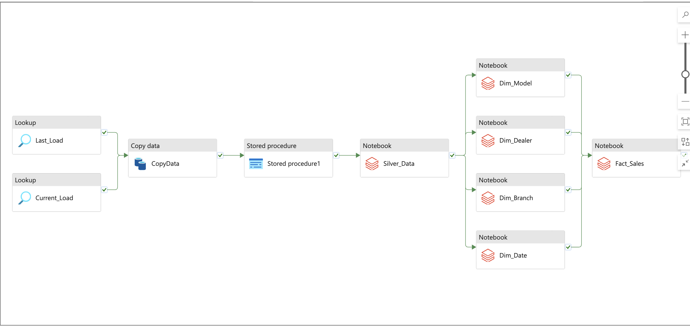

# 🚀 Azure End-to-End Data Engineering Project

## 📌 Project Overview
This project is a comprehensive **Azure Data Engineering** pipeline designed to handle real-world scenarios. It demonstrates **incremental data loading**, **dimensional data modeling (Star Schema)**, **slowly changing dimensions (SCDs)**, and follows the **Medallion Architecture** to ensure data quality and governance.

## 🏗️ Architecture Diagram


## 🎯 Key Features
- **Azure Data Engineering Stack**: Utilizes **Azure Data Lake, Azure SQL Database, Azure Data Factory, Azure Databricks**, and **Unity Catalog**.
- **Medallion Architecture**: Implements **Bronze (Raw), Silver (Transformed), and Gold (Aggregated)** layers.
- **Incremental Data Loading**: Uses **Change Data Capture (CDC)** to process only new data.
- **Star Schema & Dimensional Modeling**: Segregates data into **fact and dimension tables**.
- **SCD Handling**: Implements **Type 1 (upsert)** to track historical changes.
- **Data Governance & Security**: Managed using **Unity Catalog** for data lineage and access control.
- **Data Format Optimization**: Converts CSV data to **Parquet format** for better performance.

---

## 🏛️ Tech Stack
- **Storage & Database**: Azure Data Lake, Azure SQL Database
- **ETL Processing**: Azure Data Factory
- **Data Transformation**: Azure Databricks (PySpark)
- **Data Governance**: Unity Catalog
- **Visualization**: Power BI (for reporting)

---

## 📂 Data Flow
1. **Data Ingestion**: Data is pulled from a GitHub repository into **Azure SQL Database**.
2. **Data Transformation**: Using **Databricks**, data is processed from **Bronze → Silver → Gold layers**.
3. **Incremental Loading**: Uses **CDC & stored procedures** to process only new records.
4. **Star Schema Implementation**: Data is structured into **fact and dimension tables**.
5. **Data Serving**: Processed data is stored in **Gold Layer** and connected to **Power BI**.

---

## 🚀 Implementation Steps
1. **Setup Azure Services**
   - Create **Azure SQL Database, Data Lake, Data Factory, and Databricks**.
   - Configure **Unity Catalog** for data governance.

2. **Data Ingestion**
   - Use **Azure Data Factory (ADF)** to pull data from GitHub to **Azure SQL**.
   - Store data in **Bronze Layer** (Raw).

3. **Incremental Data Loading**
   - Implement **CDC (Change Data Capture)** for efficient updates.
   - Use a **Watermark Table** to track the last processed date.

4. **Data Transformation with Databricks**
   - Convert raw data (CSV) to **Parquet format**.
   - Apply **business logic, cleansing, and transformations**.
   - Load structured data into **Silver & Gold layers**.

5. **Dimensional Modeling**
   - Implement a **Star Schema**:
     - **Fact Table**: Transactional data (sales, revenue).
     - **Dimension Tables**: Date, Product, Customer, Location.

6. **Data Governance & Security**
   - Implement **Unity Catalog** for access control.
   - Enforce **data quality & validation checks**.

7. **Reporting with Power BI**
   - Establish a connection to **Gold Layer** for visualization.

---

## 📊 Medallion Architecture
```
   ┌──────────┐
   │  Bronze  │  (Raw Data)
   └──────────┘
         ↓
   ┌──────────┐
   │  Silver  │  (Transformed Data)
   └──────────┘
         ↓
   ┌──────────┐
   │   Gold   │  (Aggregated Data for Reporting)
   └──────────┘
```

---

## 📂 Folder Structure
```
📁 Azure-Data-Engineering-Project
│── 📂 data
│   ├── initial_load.csv
│   ├── incremental_load.csv
│── 📂 notebooks
│   ├── etl_pipeline.py
│   ├── star_schema_modeling.py
│── 📂 scripts
│   ├── create_watermark_table.sql
│   ├── incremental_load.sql
│── README.md
│── architecture.png
```

---

## 🛠️ How to Run the Project
1. Clone the repository:
   ```bash
   git clone https://github.com/your-username/Azure-Data-Engineering-Project.git
   cd Azure-Data-Engineering-Project
   ```
2. Setup **Azure Services** (Data Lake, Data Factory, SQL, Databricks).
3. Deploy **Data Factory pipelines** (`initial_load`, `incremental_load`).
4. Run **Databricks Notebooks** to transform data.
5. Query **Star Schema tables** in Azure SQL.
6. Connect Power BI to the **Gold Layer**.

---

## 📌 Key Learnings
✔ Understanding **Azure Data Engineering** stack  
✔ Implementing **incremental data loading** & **CDC**  
✔ Working with **Databricks, Parquet, and Unity Catalog**  
✔ Applying **Dimensional Modeling & Star Schema**  
✔ Building **Production-ready Pipelines**  

---

## 📢 Conclusion
This project provides a **real-world Azure Data Engineering experience** with **hands-on implementation** of best practices. Feel free to contribute, raise issues, or suggest improvements! 🚀  

---

### 🔗 Connect with Me  
📧 Email: `manisharora0311@gmail.com'  
🔗 LinkedIn: Manish Arora(https://www.linkedin.com/in/manisharoraexists/)  

